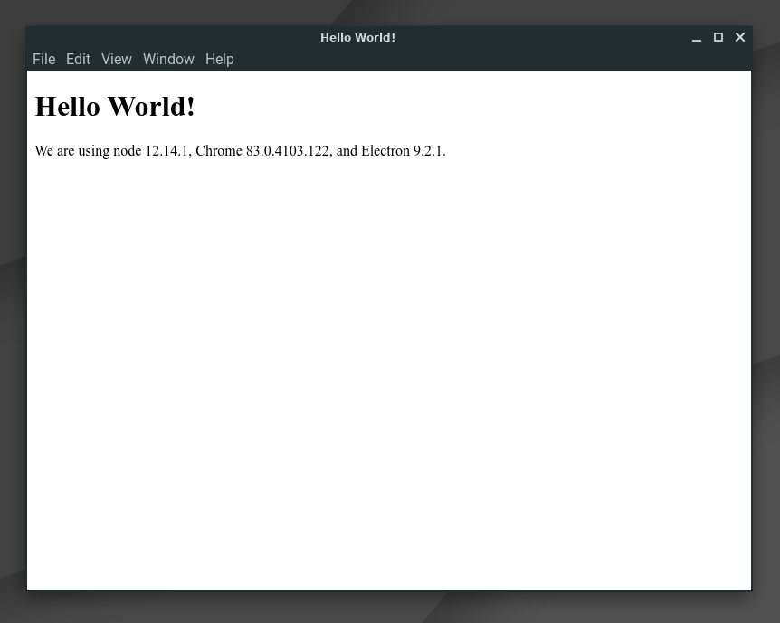
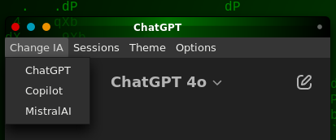
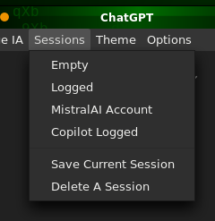
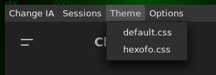
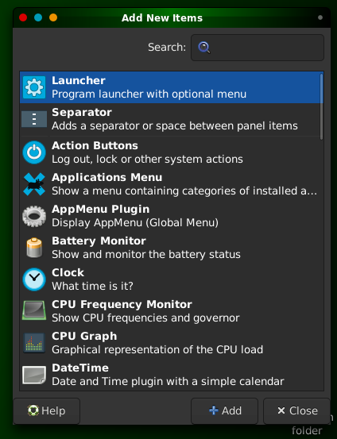
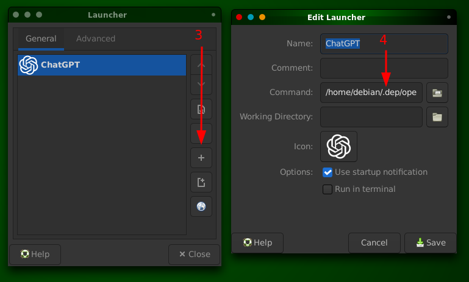

# ChatGPT Electron



## Features

1. #### Session manager to change account easily,
2. #### Streamer mode to hide your name, mail and avatar
3. #### Change assistant (GPT, Copilot, Mistral, more soon)
4. #### Custom CSS themes

| OS | Location of folder for CSS themes |
|---|---|
| Windows	| `C:\Users\{username}\AppData\Roaming\chatgpt-electron` |
| macOS	| `/Users/{username}/Library/Application Support/chatgpt-electron` |
| Linux	| `/home/{username}/.config/chatgpt-electron` |







## Requirements

- [NodeJS](https://nodejs.org) v20 or +

## Installation

### Generate package
```sh
npm i
npm run package
```
This will create a folder (ie: `out/chatgpt-electron-linux-x64`) which contains the executable file for Debian.

You can directly run `out/chatgpt-electron-linux-x64/chatgpt-electron` or you may want to use it in a "widget":

### Use on Windows

1. Move the executable folder `out/chatgpt-electron-win32-x64` anywhere you like it

2. Run `chatgpt-electron.exe` and enjoy!

### Use on MacOS

1. Move the executable folder `out/chatgpt-electron-darwin-arm64` anywhere you like it

2. Run `chatgpt-electron.app` and enjoy!

### Use on Linux

1. Move the executable folder `out/chatgpt-electron-linux-x64` anywhere you like it

2. run `chatgpt-electron-linux-x64/chatgpt-electron` and enjoy!

### Panel shortcut in XFCE

#### Requirements

- xdotool `apt install xdotool`
- wmctrl `apt install wmctrl`

To make a shortcut to open a controlled window from your XFCE panel, you need to call your `./open_chatgpt.sh`.

The goal of `./open_chatgpt.sh` is to find the Electron window then resize it at will. 

It works with a `package` output and I did NOT tested it with deb and rpm.

1. Right click on your XFCE Panel > "Panel" > "Add new items..."

2. Double-click on "Launcher":



3. In the "Launcher" window, press the "+" button.

4. In the "Edit Launcher" window, configure the Launcher so the command will open your `open_chatgpt.sh` from its path:



5. Optional: Name the shortcut and select an Icon (you can copy it from `GPT.svg`)

6. Save, Close, Enjoy!

## Credits

This was made by [Axel Andaroth (aka Pirate)](https://anda.ninja) for personal use with Debian 12 XFCE.

Source is open because sharing is caring but I don't plan to spend time to maintain nor to update this project. 

Thanks for your support!
